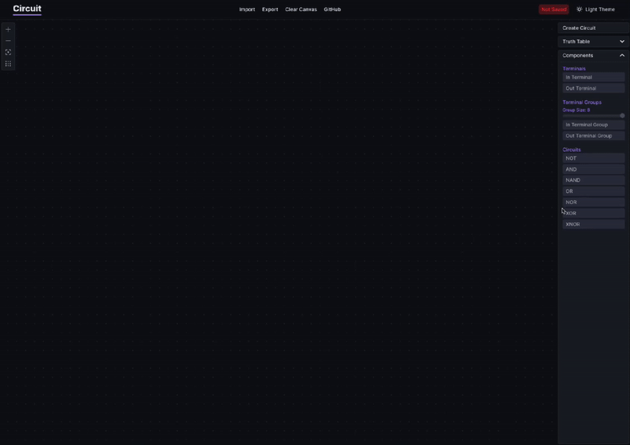

<a href="https://circuit.alexwith.com">
    

        
    

</a>

  <strong>Build and simulate circuits using logic gates</strong>

---

## The Project
Circuit is a web app that lets you build and test simple logic circuits right in your browser. It's a fun tool to explore how computers work under the hood. You can check the app out at [circuit.alexwith.com](https://circuit.alexwith.com/). 

This is an improved version of my earlier project, [Logic Gates](https://github.com/alexwith/logic-gates), with lots of improvements like an infinite canvas, zooming, better performance, support for more complex circuits, and lots of other smaller tweaks that makes it a better experience.

## Preview
### 4-Bit Adder
https://github.com/user-attachments/assets/651e089a-3a76-4bee-b2e0-8cf175961652

### S-R Latch

## License
Circuit is free and open source software. The software is released under the terms of the [GPL-3.0 license](https://github.com/alexwith/circuit/blob/main/LICENSE).
